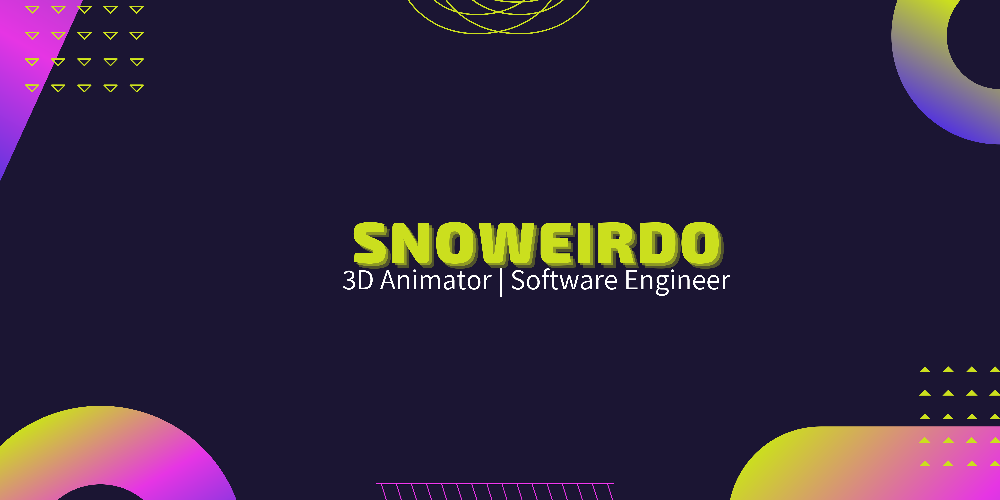

  

  

# About Me

- :date: I've been coding for 2 years.
- :trophy: I started building tech that would help people in a greater way. 
- 🖥️: I like using software to solve `problems` that I struggle with.
- 📚: I’m currently learning `Next.js` and `TailwindCSS`.
- :nerd_face: Always `learning new things`.
- :thinking: I’m currently open to new `opportunities` and `collaboration `.
 

<!-- 

<button class="button" style="vertical-align:middle"></button>

 -->

# 💻 Tech Stack:
                     	   

---

 

	<a href="https://github.com/piyushsuthar/github-readme-quotes"> 

 <h3>GitHub Stats</h3>

 
 

---

  

<h3>⚡ Recent GitHub Activity</h3>

----
	

 

 <h3>🏆 Git profile Trophies </h3>

----
	

	

	

	
